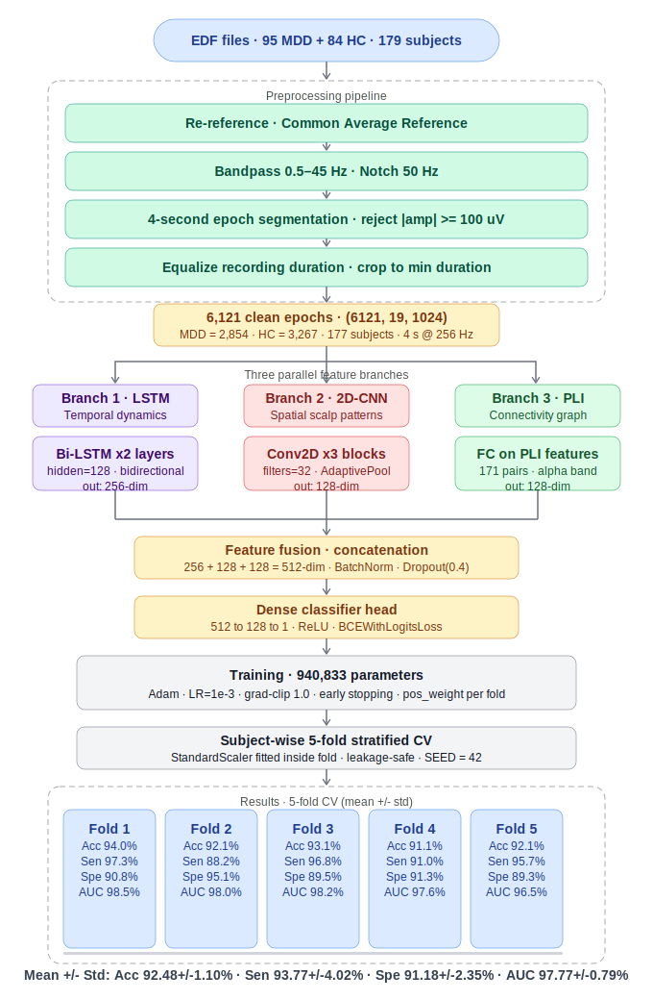
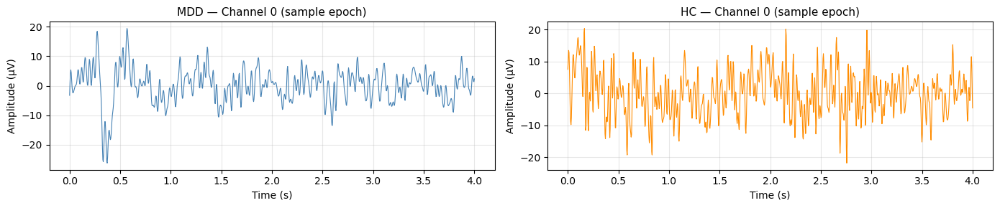
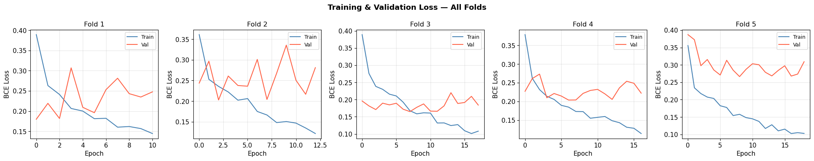
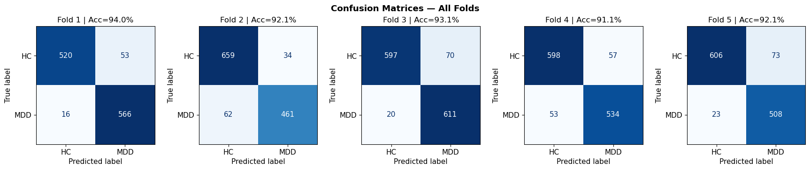
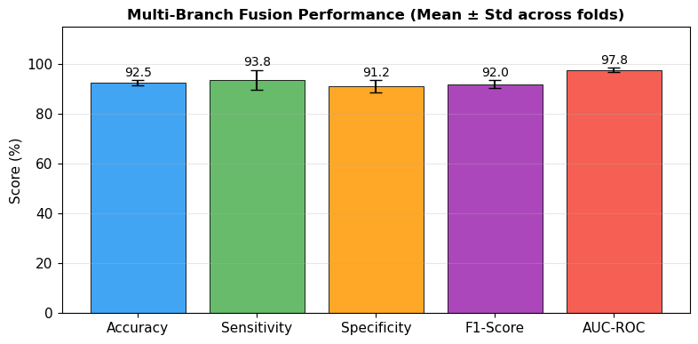

# EEG-Based MDD Classification: Multi-Branch Deep Learning Pipeline

> **Temporal (LSTM) · Spatial (2D-CNN) · Connectivity (PLI) → Fusion Classifier**

A Jupyter notebook implementing a three-branch deep learning architecture for Major Depressive Disorder (MDD) detection from resting-state EEG. Three parallel branches capture complementary signal representations — temporal dynamics (Bidirectional LSTM), spatial scalp patterns (2D-CNN), and functional connectivity (Phase Lag Index) — which are fused and classified through a dense head. Subject-wise stratified 5-fold cross-validation ensures no data leakage between subjects.

---

## Table of Contents

1. [Project Overview](#project-overview)
2. [Methodology Pipeline](#methodology-pipeline)
3. [Dataset & Directory Structure](#dataset--directory-structure)
4. [Installation](#installation)
5. [Configuration](#configuration)
6. [Notebook Cells](#notebook-cells)
7. [Model Architecture](#model-architecture)
8. [Three Branches in Detail](#three-branches-in-detail)
9. [Training Protocol](#training-protocol)
10. [Results](#results)
11. [Figures](#figures)
12. [Leakage & Safety Audit](#leakage--safety-audit)
13. [Saved Outputs](#saved-outputs)
14. [Dependencies](#dependencies)

---

## Project Overview

| Item | Detail |
|------|--------|
| Task | Binary classification: MDD (label 1) vs Healthy Control HC (label 0) |
| Subjects | 95 MDD + 84 HC = 179 total · **177 unique** (2 skipped — unrecognised prefix) |
| Clean epochs | **6,121** (MDD = 2,854 · HC = 3,267) |
| Epoch shape | `(6121, 19, 1024)` — 19 channels · 1,024 samples · 4 s @ 256 Hz |
| PLI features | **171** upper-triangle channel pairs (19×18/2) · alpha band |
| Architecture | Three-branch fusion DL · **940,833 parameters** |
| Loss | `BCEWithLogitsLoss` with per-fold `pos_weight` for class imbalance |
| Validation | **Subject-wise** 5-fold stratified CV · leakage-safe |
| Best result | **Accuracy 92.48 ± 1.10%** · AUC-ROC **97.77 ± 0.79%** |

---

## Methodology Pipeline



---

## Dataset & Directory Structure

```
project-root/
├── EEG/                           ← all .edf files
│   ├── MDD S1 EO.edf              → label 1
│   ├── H S1 EO.edf                → label 0
│   └── ...
├── processed/                     ← auto-created preprocessed cache
│   ├── X.npy                      (6121, 19, 1024)
│   ├── y.npy                      (6121,)
│   ├── subject_ids.npy            (6121,)
│   └── C.npy                      (6121, 171) PLI features
├── results/                       ← auto-created outputs
│   ├── fold_results.csv
│   ├── summary_results.csv
│   ├── ieee_table2.csv
│   ├── fig_sample_epochs.png
│   ├── fig_loss_curves.png
│   ├── fig_confusion_matrices.png
│   └── fig_metric_bar.png
├── 1_EEG_MDD_MultiBranch_Pipeline.ipynb
└── README.md
```

Files prefixed `MDD` → label 1. Files prefixed `H` → label 0. Unrecognised prefixes are skipped.

---

## Installation

```bash
pip install mne numpy scipy scikit-learn matplotlib seaborn tqdm torch torchvision
```

---

## Configuration

All parameters are set in **Cell 3 — Global Configuration** (`CFG` dict):

| Parameter | Value | Description |
|-----------|-------|-------------|
| `sfreq` | `256` Hz | Expected sampling frequency |
| `l_freq` | `0.5` Hz | Bandpass lower cutoff |
| `h_freq` | `45.0` Hz | Bandpass upper cutoff |
| `notch_freq` | `50.0` Hz | Power-line notch filter |
| `epoch_sec` | `4.0` s | Window length (1,024 samples) |
| `amp_thresh` | `100 µV` | Artifact rejection threshold |
| `lstm_hidden` | `128` | LSTM hidden units per direction |
| `cnn_filters` | `32` | 2D-CNN initial filter count |
| `dropout` | `0.4` | Dropout rate (all branches) |
| `lr` | `1e-3` | Adam learning rate |
| `k_folds` | `5` | Number of CV folds |
| `batch_size` | `32` | Training batch size |
| `pli_band` | alpha (8–13 Hz) | Band for PLI connectivity |
| `SEED` | `42` | Global reproducibility seed |

**19-channel 10-20 system:**
`Fp1, F3, C3, P3, O1, F7, T3, T5, Fz, Fp2, F4, C4, P4, O2, F8, T4, T6, Cz, Pz`

---

## Notebook Cells

| Cell | Description |
|------|-------------|
| 0 | Dataset path setup · count MDD / HC EDF files |
| 1 | Install dependencies (`pip install`) |
| 2 | Imports: MNE, PyTorch, sklearn, scipy, seaborn |
| 3 | Global configuration (`CFG` dict) |
| 4 | Preprocessing pipeline: load, re-reference, bandpass, notch, equalize, epoch, reject |
| 5 | Preprocessing sanity checks · dataset audit · sample epoch plots |
| 6 | PLI connectivity extraction · alpha-band · 171 upper-triangle features |
| 7 | Model architecture: `TemporalBranch`, `SpatialBranch`, `ConnectivityBranch`, `FusionModel` |
| 8 | Subject-wise K-fold training loop · early stopping · per-fold `pos_weight` |
| 9 | IEEE-format results table · save to CSV |
| 10 | Figures: loss curves, confusion matrices, metric bar chart |
| 11 | Wilcoxon signed-rank significance tests vs chance (0.50) |
| 12 | Reviewer-safety audit (9 automated leakage checks) |
| 13 | Ablation study framework (`RUN_ABLATION = True` to activate) |
| 14 | IEEE paper results template · supervisor checklist |

---

## Model Architecture

```
Input: (batch, 19, 1024)              PLI: (batch, 171)
         │                                   │
  ┌──────┴──────┐                            │
  │             │                            │
Temporal     Spatial                  Connectivity
(Bi-LSTM)   (2D-CNN)                   (FC head)
  │             │                            │
256-dim      128-dim                      128-dim
  │             │                            │
  └──────┬──────┘                            │
         └──────────────┬────────────────────┘
                  Concatenate (512-dim)
                  BatchNorm + Dropout(0.4)
                         │
                   FC(512→128) + ReLU
                   Dropout(0.4)
                   FC(128→1)
                   BCEWithLogitsLoss
                         │
                  MDD / HC prediction
```

**Total parameters: 940,833** (all trainable)

| Branch | Output dim | Notes |
|--------|-----------|-------|
| Temporal (Bi-LSTM) | 256 | 2-layer BiLSTM · LayerNorm · Dropout |
| Spatial (2D-CNN) | 128 | 3× `Conv2D→BN→ReLU→MaxPool` · AdaptiveAvgPool |
| Connectivity (FC) | 128 | PLI upper-triangle → FC(171→128) · ReLU |

---

## Three Branches in Detail

### Branch 1 — Temporal (Bidirectional LSTM)

Captures long-range temporal dependencies in the EEG time series.

- Input shape: `(batch, T, n_ch)` — transposed so each time-step is an n_ch-dim feature
- Architecture: 2-layer `nn.LSTM(input=19, hidden=128, bidirectional=True)`
- Last hidden state of forward and backward passes concatenated → 256-dim
- Followed by `LayerNorm` + `Dropout(0.4)`

### Branch 2 — Spatial (2D-CNN)

Treats the EEG epoch as a 2D image (channels × time) and learns local spatial-temporal patterns across the scalp.

- Input shape: `(batch, 1, n_ch, T)` — single input channel
- Three `ConvBlock2D`: `Conv2D → BatchNorm → ReLU → MaxPool2D`
- Filter progression: 1 → 32 → 64 → 128
- `AdaptiveAvgPool2d(1,1)` collapses spatial dimensions → 128-dim flat vector

### Branch 3 — Connectivity (Phase Lag Index)

Encodes functional synchronisation between all channel pairs in the alpha band (8–13 Hz).

- PLI computation per epoch: bandpass → Hilbert transform → instantaneous phase → `|mean(sign(sin(Δφ)))|`
- Upper-triangle of the 19×19 PLI matrix → **171 features** per epoch
- Features passed through a 2-layer FC head: `171 → 128 → 128` with ReLU and Dropout

---

## Training Protocol

| Setting | Detail |
|---------|--------|
| Optimiser | Adam, `lr = 1e-3` |
| Loss | `BCEWithLogitsLoss` |
| Class imbalance | `pos_weight` computed per fold from training labels |
| Gradient clipping | `max_norm = 1.0` |
| Early stopping | Monitor `val_loss` · patience = 10 epochs |
| Model selection | Best checkpoint by `val_loss` (not test AUC) |
| Normalisation | `StandardScaler` fitted on train fold only, applied to test |
| Batch size | 32 |
| Splits | Subject-wise `StratifiedKFold(n_splits=5)` on unique subject IDs |

Early stopping triggered at epochs 11, 13, 18, 17, 19 for folds 1–5.

---

## Results

### 5-fold subject-wise cross-validation

| Fold | Accuracy | Sensitivity | Specificity | F1-Score | AUC-ROC |
|------|----------|-------------|-------------|----------|---------|
| 1 | 94.03% | 97.25% | 90.75% | 94.25% | 98.54% |
| 2 | 92.11% | 88.15% | 95.09% | 90.57% | 98.04% |
| 3 | 93.07% | 96.83% | 89.51% | 93.14% | 98.18% |
| 4 | 91.14% | 90.97% | 91.30% | 90.66% | 97.55% |
| 5 | 92.07% | 95.67% | 89.25% | 91.37% | 96.51% |
| **Mean ± Std** | **92.48 ± 1.10%** | **93.77 ± 4.02%** | **91.18 ± 2.35%** | **92.00 ± 1.63%** | **97.77 ± 0.79%** |

**Key observations:**

- AUC-ROC of **97.77%** indicates near-perfect class separation across all folds.
- Sensitivity (93.77%) consistently exceeds specificity (91.18%), showing the model is slightly biased toward detecting MDD — appropriate for a clinical screening task.
- Fold variance is low for accuracy (±1.10%) and AUC (±0.79%), confirming stable generalisation across subject splits.
- Sensitivity variance is higher (±4.02%) — driven by fold 2 (88.15%) where the model was more conservative in predicting MDD.

> **Wilcoxon test note:** With only 5 folds, the signed-rank test yields p = 0.0625 (ns) for all metrics vs. chance. For a Q1 publication, increase K or apply permutation testing to strengthen the statistical argument.

---

## Figures

### Sample epochs — MDD vs HC



Example 4-second EEG epochs from Channel 0 (Fp1): MDD subject (blue, left) vs healthy control (orange, right). Both are after preprocessing, re-referencing, and bandpass filtering.

---

### Training and validation loss curves



BCE loss per epoch for all 5 folds. Training loss (blue) decreases steadily in all folds. Validation loss (red) shows early convergence, with the model checkpointed at the minimum validation loss to prevent overfitting. Early stopping triggers between epochs 11–19.

---

### Confusion matrices — all folds



Per-fold confusion matrices (HC = 0, MDD = 1). All folds achieve strong diagonal dominance. Fold 1 has the fewest MDD misses (FN = 16), while Fold 2 has slightly more MDD misses (FN = 62) but the best HC precision.

| Fold | TP (MDD→MDD) | FN (MDD→HC) | FP (HC→MDD) | TN (HC→HC) |
|------|-------------|------------|------------|-----------|
| 1 | 566 | 16 | 53 | 520 |
| 2 | 461 | 62 | 34 | 659 |
| 3 | 611 | 20 | 70 | 597 |
| 4 | 534 | 53 | 57 | 598 |
| 5 | 508 | 23 | 73 | 606 |

---

### Metric bar chart (mean ± std)



Summary bar chart of all five metrics averaged across folds with standard deviation error bars. AUC-ROC (97.8%) leads, followed by sensitivity (93.8%), accuracy (92.5%), F1-Score (92.0%), and specificity (91.2%).

---

## Leakage & Safety Audit

The notebook passes all 9 automated leakage checks (Cell 12):

| Check | Status | Detail |
|-------|--------|--------|
| Subject-wise fold splitting | ✓ PASS | `StratifiedKFold` on unique subject IDs |
| EEG scaler on train only | ✓ PASS | `StandardScaler.fit()` inside fold loop |
| Connectivity scaler on train only | ✓ PASS | `StandardScaler.fit()` on `C_tr` inside fold |
| PLI extracted before fold split | ✓ PASS | No scaler in PLI computation |
| Artifact rejection before split | ✓ PASS | Per-epoch threshold, no cross-epoch stats |
| Model selection via val loss | ✓ PASS | Early stopping on `val_loss`, not test AUC |
| Class imbalance addressed | ✓ PASS | `pos_weight` computed per fold from `y_tr` |
| Reproducibility seeds | ✓ PASS | numpy, torch, cuda seeded with `SEED=42` |
| Subject-level stratification | ✓ PASS | `sub_labels` computed before `KFold.split()` |

**Open items for Q1 submission:**
- External validation on an independent dataset
- Ablation: test each branch in isolation vs. full fusion (`RUN_ABLATION = True`)
- Justify alpha-band PLI selection in the methods section
- Bootstrap confidence intervals over folds
- Statistical comparison vs. published baselines (e.g., MODMA dataset results)

---

## Saved Outputs

| File | Contents |
|------|----------|
| `processed/X.npy` | Preprocessed EEG epochs `(6121, 19, 1024)` |
| `processed/y.npy` | Labels `(6121,)` |
| `processed/subject_ids.npy` | Subject ID per epoch `(6121,)` |
| `processed/C.npy` | PLI connectivity features `(6121, 171)` |
| `results/fold_results.csv` | Per-fold metrics |
| `results/summary_results.csv` | Mean ± std summary |
| `results/ieee_table2.csv` | IEEE-format Table 2 |
| `results/fig_sample_epochs.png` | Sample MDD / HC epoch waveforms |
| `results/fig_loss_curves.png` | Training & validation loss per fold |
| `results/fig_confusion_matrices.png` | Confusion matrices for all 5 folds |
| `results/fig_metric_bar.png` | Mean ± std metric bar chart |

---

## Dependencies

| Library | Purpose |
|---------|---------|
| `mne` | EDF loading, re-referencing, filtering, epoching |
| `numpy`, `scipy` | Numerical ops, Hilbert transform for PLI |
| `torch`, `torchvision` | LSTM, 2D-CNN, fusion model, training loop |
| `sklearn` | `StratifiedKFold`, `StandardScaler`, metrics |
| `matplotlib`, `seaborn` | Loss curves, confusion matrices, bar charts |
| `tqdm` | Progress bars during preprocessing |
| `pandas` | Results tables and CSV export |
