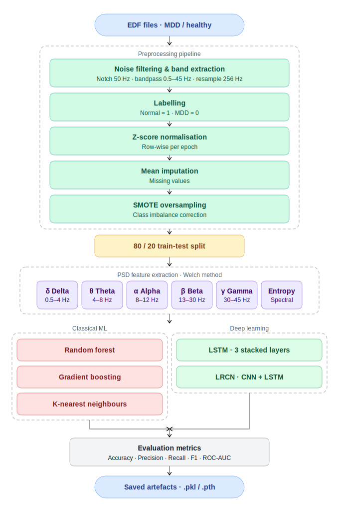
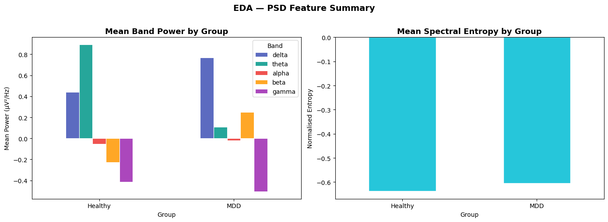
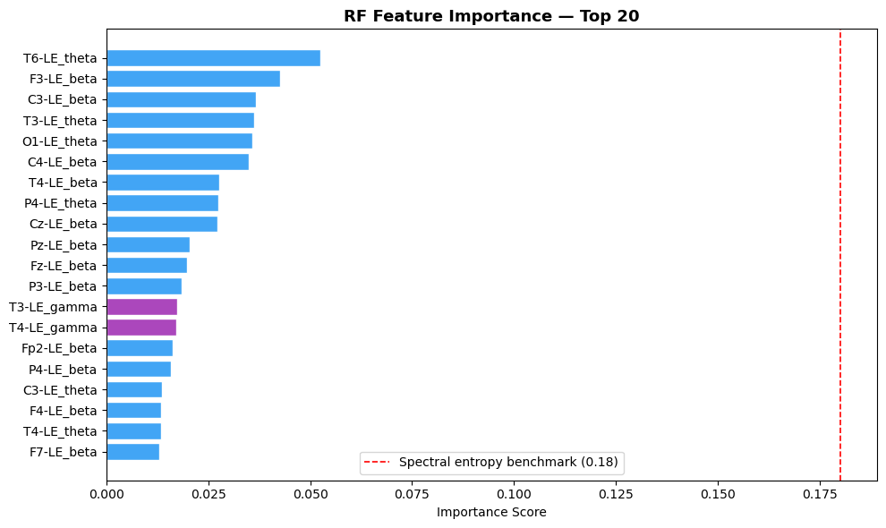
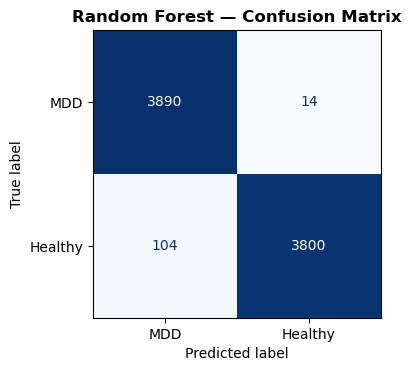
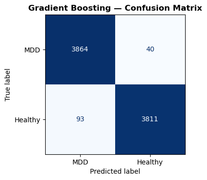
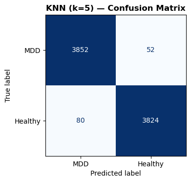

# EEG-Based Major Depressive Disorder (MDD) Classification

> **PSD Feature Extraction · Random Forest · Gradient Boosting · KNN · LSTM · LRCN**

A Jupyter notebook pipeline for classifying Major Depressive Disorder (MDD) from resting-state EEG recordings. Raw EDF files are preprocessed, transformed into Power Spectral Density (PSD) features, and fed into five machine learning and deep learning classifiers, with full evaluation and model serialisation.

---

## Table of Contents

1. [Project Overview](#project-overview)
2. [Methodology Pipeline](#methodology-pipeline)
3. [Dataset & Directory Structure](#dataset--directory-structure)
4. [Installation](#installation)
5. [Configuration](#configuration)
6. [Notebook Sections](#notebook-sections)
7. [Models](#models)
8. [Evaluation](#evaluation)
9. [Saved Artefacts](#saved-artefacts)
10. [Dependencies](#dependencies)

---

## Project Overview

This project uses resting-state EEG signals to distinguish between healthy controls (label `1`) and individuals with Major Depressive Disorder (label `0`). Features are derived from the Power Spectral Density (PSD) across five canonical frequency bands, plus per-channel spectral entropy.

Five classifiers are trained and benchmarked end-to-end:

| # | Model | Type |
|---|-------|------|
| 1 | Random Forest (RF) | Classical ML |
| 2 | Gradient Boosting (GB) | Classical ML |
| 3 | K-Nearest Neighbours (KNN) | Classical ML |
| 4 | LSTM (3 stacked layers) | Deep Learning |
| 5 | LRCN (CNN + LSTM) | Deep Learning |

---

## Methodology Pipeline



---

## Dataset & Directory Structure

Place all `.edf` files (MDD and healthy subjects) inside a folder named `EEG Data/` at the project root. The notebook automatically assigns labels based on the filenames.

```
project-root/
├── EEG Data/
│   ├── subject_mdd_01.edf
│   ├── subject_healthy_01.edf
│   └── ...
├── 10_EEG_MDD_PSD_Classification.ipynb
└── README.md
```

---

## Installation

```bash
pip install mne numpy pandas matplotlib seaborn scipy tqdm \
            scikit-learn imbalanced-learn torch
```

> PyTorch GPU support: visit [pytorch.org](https://pytorch.org/get-started/locally/) for the correct CUDA install command for your platform.

---

## Configuration

All key hyperparameters are centralised in **Section 2** of the notebook:

| Parameter | Default | Description |
|-----------|---------|-------------|
| `SELECTED_CHANNELS` | `CHANNELS_19` | Use all 19 channels or 4 frontal channels |
| `SFREQ_TARGET` | `256` Hz | Resample target sampling frequency |
| `NOTCH_FREQ` | `50.0` Hz | Power-line noise notch filter |
| `BP_LOW / BP_HIGH` | `0.5 – 45.0` Hz | Bandpass filter range |
| `WINDOW_SEC` | `4` s | Epoch length |
| `OVERLAP` | `0.5` | 50% window overlap |
| `DATA_DIR` | `'EEG Data'` | Folder containing `.edf` files |
| `SEED` | `42` | Global random seed |

**Frequency Bands:**

| Band | Range |
|------|-------|
| Delta | 0.5 – 4.0 Hz |
| Theta | 4.0 – 8.0 Hz |
| Alpha | 8.0 – 12.0 Hz |
| Beta | 13.0 – 30.0 Hz |
| Gamma | 30.0 – 45.0 Hz |

**EEG Channels (19-channel 10-20 system):**
`Fp1, F3, C3, P3, O1, F7, T3, T5, Fz, Fp2, F4, C4, P4, O2, F8, T4, T6, Cz, Pz`

---

## Notebook Sections

| # | Section | Description |
|---|---------|-------------|
| 0 | Install Dependencies | `pip install` commands for all required packages |
| 1 | Imports & Global Configuration | Library imports, SEED, device detection |
| 2 | Channel Configuration & Hyperparameters | Channel sets, band definitions, preprocessing params |
| 3 | Data Loading — EDF Files | Load raw EDF recordings with MNE |
| 4 | Preprocessing — Step 1 | Notch filter, bandpass filter, resampling |
| 5 | Feature Extraction — PSD + Spectral Entropy | Per-channel Welch PSD and spectral entropy |
| 6 | Build Raw Feature Matrix | Aggregate features across all EDF files |
| 7 | Preprocessing Steps 2–5 | Labelling, Z-score, imputation, SMOTE |
| 8 | EDA | Feature distribution plots, band power visualisation |
| 9 | Utility — Metrics Reporter | Shared helper to print classification metrics |
| 10 | Model 1 — Random Forest | Train & evaluate RF classifier |
| 11 | Model 2 — Gradient Boosting | Train & evaluate GB classifier |
| 12 | Model 3 — KNN (k=5) | Train & evaluate KNN with distance weighting |
| 13 | Deep Learning — Shared Helpers | Dataset wrappers, training loop, callbacks |
| 14 | Model 4 — LSTM | 3-layer stacked LSTM (hidden = 128) |
| 15 | Model 5 — LRCN | CNN (out = 32) + LSTM (hidden = 128, 2 layers) |
| 16 | Comparative Results Dashboard | Side-by-side metrics table & ROC curves |
| 17 | Cross-Validation — ML Models | 5-fold Stratified CV for RF, GB, KNN |
| 18 | Save Models & Artefacts | Persist all trained models to disk |

---

## Models

### Classical ML

| Model | Key Hyperparameters |
|-------|---------------------|
| Random Forest | `n_estimators=300`, `max_features='sqrt'`, `class_weight='balanced'` |
| Gradient Boosting | `n_estimators=200`, `max_depth=5`, `learning_rate=0.05` |
| KNN | `n_neighbors=5`, `weights='distance'` (with `StandardScaler`) |

### Deep Learning (PyTorch)

| Model | Architecture |
|-------|-------------|
| LSTM | 3 stacked LSTM layers, `hidden_size=128` |
| LRCN | 1D CNN (`cnn_out=32`) → 2-layer LSTM (`lstm_hidden=128`) |

---

## Evaluation

Each model is assessed on a held-out 20% test split using:

- Accuracy
- Precision
- Recall
- F1 Score
- ROC-AUC

Cross-validation (5-fold Stratified KFold) is additionally run for RF, GB, and KNN, with mean scores reported across folds.

---

## Saved Artefacts

After running Section 18, the following files are written to the working directory:

| File | Contents |
|------|----------|
| `rf_mdd.pkl` | Trained Random Forest model |
| `gb_mdd.pkl` | Trained Gradient Boosting model |
| `knn_mdd.pkl` | Trained KNN model |
| `knn_scaler.pkl` | StandardScaler fitted for KNN |
| `imputer.pkl` | Mean imputer for missing values |
| `lstm_mdd.pth` | LSTM state dict + architecture config |
| `lrcn_mdd.pth` | LRCN state dict + architecture config |

---

## Results

> LSTM and LRCN models encountered a `TypeError` during training in this run and did not produce evaluation output. Results below cover the three classical ML models only.

### Dataset summary

| Split | Total samples | MDD (0) | Healthy (1) |
|-------|--------------|---------|-------------|
| Raw (before SMOTE) | 36,473 | 19,520 | 16,953 |
| After SMOTE | 39,040 | 19,520 | 19,520 |
| Train (80%) | 31,232 | — | — |
| Test (20%) | 7,808 | 3,904 | 3,904 |

Features: **114 total** (19 channels × 6 features per channel: δ, θ, α, β, γ power + spectral entropy)

---

### Model performance on 20% held-out test set

| Model | Accuracy | Precision | Recall | Specificity | F1 Score | ROC-AUC |
|-------|----------|-----------|--------|-------------|----------|---------|
| **Random Forest** | **98.49%** | **99.63%** | 97.34% | **99.64%** | **98.47%** | **0.9987** |
| Gradient Boosting | 98.30% | 98.96% | 97.62% | 98.98% | 98.28% | 0.9983 |
| KNN (k=5) | 98.31% | 98.66% | **97.95%** | 98.67% | 98.30% | 0.9979 |
| LSTM | — | — | — | — | — | — |
| LRCN | — | — | — | — | — | — |

**Random Forest achieves the best overall performance** with the highest accuracy (98.49%), precision (99.63%), F1 (98.47%), and ROC-AUC (0.9987). All three ML models surpass 98% accuracy on the test set.

---

### EDA — PSD feature summary



MDD subjects show notably higher **delta and beta** band power, while healthy subjects show higher **theta** power. Spectral entropy is lower in both groups but shows a slight MDD vs healthy separation.

---

### RF feature importance — top 20



**Theta and beta** band features dominate importance scores. The top feature is `T6-LE_theta` (temporal-occipital region), followed by frontal and central beta features. The red dashed benchmark shows spectral entropy at 0.18, substantially outperforming all individual PSD band features.

---

## Confusion Matrices

Test set size: **7,808 samples** (3,904 MDD · 3,904 Healthy).

### Random Forest



| | Predicted MDD | Predicted Healthy |
|---|---|---|
| **True MDD** | 3,890 ✅ | 14 ❌ |
| **True Healthy** | 104 ❌ | 3,800 ✅ |

False negatives (MDD missed): **14** · False positives (Healthy misclassified): **104**

---

### Gradient Boosting



| | Predicted MDD | Predicted Healthy |
|---|---|---|
| **True MDD** | 3,864 ✅ | 40 ❌ |
| **True Healthy** | 93 ❌ | 3,811 ✅ |

False negatives: **40** · False positives: **93**

---

### KNN (k=5)



| | Predicted MDD | Predicted Healthy |
|---|---|---|
| **True MDD** | 3,852 ✅ | 52 ❌ |
| **True Healthy** | 80 ❌ | 3,824 ✅ |

False negatives: **52** · False positives: **80**

---

### Confusion matrix comparison

| Model | TP (MDD→MDD) | FN (MDD→Healthy) | FP (Healthy→MDD) | TN (Healthy→Healthy) |
|-------|-------------|-----------------|-----------------|---------------------|
| Random Forest | 3,890 | **14** | 104 | 3,800 |
| Gradient Boosting | 3,864 | 40 | **93** | 3,811 |
| KNN (k=5) | 3,852 | 52 | 80 | **3,824** |

Random Forest produces the fewest false negatives (MDD cases missed), which is the most clinically critical error type in a diagnostic setting.

---

## Dependencies

| Library | Purpose |
|---------|---------|
| `mne` | EDF file loading & EEG preprocessing |
| `numpy`, `scipy` | Numerical computation, Welch PSD |
| `pandas` | Feature matrix management |
| `matplotlib`, `seaborn` | Visualisation & EDA |
| `tqdm` | Progress bars |
| `scikit-learn` | ML models, scaling, metrics, cross-validation |
| `imbalanced-learn` | SMOTE oversampling |
| `torch` | LSTM and LRCN deep learning models |
| `joblib` | Model serialisation |
