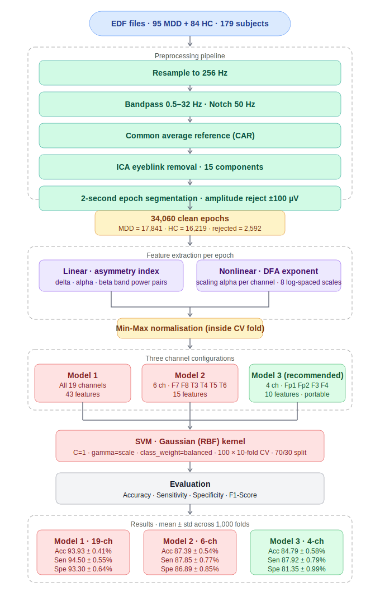
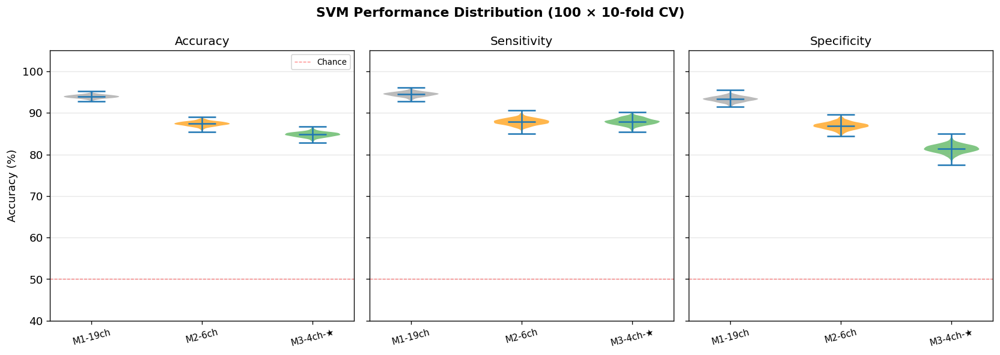
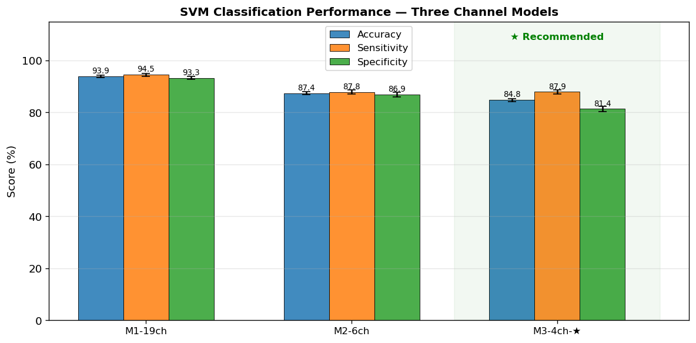
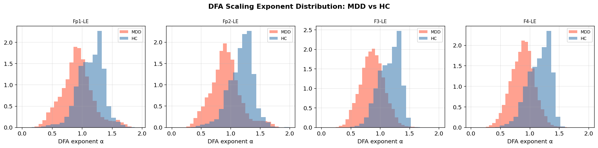
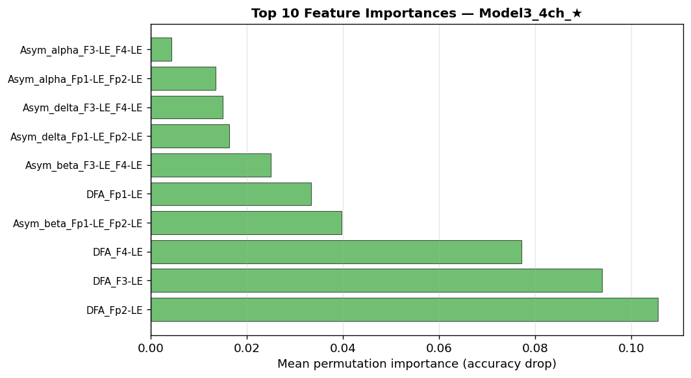

# EEG-Based MDD Classification: Asymmetry + DFA → SVM Pipeline

> **Dual-Dataset · Linear + Nonlinear Features · Three Channel Configurations**

A Jupyter notebook implementing a complete EEG classification pipeline for Major Depressive Disorder (MDD) detection using two complementary feature types — **linear interhemispheric asymmetry** (delta, alpha, beta band power) and **nonlinear Detrended Fluctuation Analysis (DFA)** scaling exponents — fed into an RBF-SVM classifier evaluated across three progressively smaller channel configurations.

---

## Table of Contents

1. [Project Overview](#project-overview)
2. [Methodology Pipeline](#methodology-pipeline)
3. [Dataset & Directory Structure](#dataset--directory-structure)
4. [Installation](#installation)
5. [Configuration](#configuration)
6. [Notebook Cells](#notebook-cells)
7. [Feature Engineering](#feature-engineering)
8. [Channel Configurations & Models](#channel-configurations--models)
9. [Results](#results)
10. [Figures](#figures)
11. [Statistical Testing](#statistical-testing)
12. [Feature Importance](#feature-importance)
13. [Saved Outputs](#saved-outputs)
14. [Dependencies](#dependencies)

---

## Project Overview

| Item | Detail |
|------|--------|
| Task | Binary classification: MDD (label 1) vs Healthy Control HC (label 0) |
| Subjects | 95 MDD + 84 HC = **179 subjects** (2 skipped — unrecognised prefix) |
| Total epochs | **34,060** clean (MDD = 17,841 · HC = 16,219 · rejected = 2,592) |
| Epoch length | 2 seconds @ 256 Hz = 512 samples |
| Feature types | Linear (asymmetry index) + Nonlinear (DFA scaling exponent α) |
| Classifier | SVM · Gaussian (RBF) kernel |
| Validation | **100 × 10-fold** stratified CV · 70% train / 30% test |
| Best model | **Model 1 (19-ch)**: 93.93% accuracy · 94.50% sensitivity |
| Portable model | **Model 3 (4-ch, ★)**: 84.79% accuracy · 87.92% sensitivity |

---

## Methodology Pipeline



---

## Dataset & Directory Structure

```
project-root/
├── EEG/                        ← folder containing all .edf files
│   ├── MDD S1 EO.edf
│   ├── H S1 EO.edf
│   └── ...
├── processed/                  ← auto-created cache (.npy)
├── results/                    ← auto-created results output
│   └── svm_results_table.csv
├── 3_EEG_MDD_AsymmetryDFA_SVM.ipynb
└── README.md
```

Files prefixed with `MDD` → label 1. Files prefixed with `H` → label 0. Unrecognised prefixes are skipped with a warning.

---

## Installation

```bash
pip install mne numpy pandas matplotlib seaborn scipy scikit-learn tqdm
```

---

## Configuration

All parameters are defined in **Cell 3 — Global Configuration** (`CFG` dict):

| Parameter | Value | Description |
|-----------|-------|-------------|
| `sfreq_target` | `256` Hz | Resampling target |
| `l_freq` | `0.5` Hz | Bandpass lower cutoff |
| `h_freq` | `32.0` Hz | Bandpass upper cutoff |
| `notch_freq` | `50.0` Hz | Power-line notch filter |
| `n_ica_components` | `15` | ICA components for artefact removal |
| `epoch_sec` | `2.0` s | Epoch duration |
| `amp_thresh` | `100 µV` | Amplitude rejection threshold |
| `bands` | delta (0.5–4), alpha (8–13), beta (13–30) Hz | Frequency bands for asymmetry |
| `dfa_scales` | 8 log-spaced values from 10 to 200 samples | DFA scale range |
| `n_repeats` | `100` | Monte Carlo CV repetitions |
| `k_folds` | `10` | Folds per repetition |
| `svm_kernel` | `rbf` | SVM kernel type |
| `svm_C` | `1` | SVM regularisation |
| `svm_gamma` | `scale` | SVM kernel coefficient |

**Asymmetry channel pairs (19-channel, 8 pairs):**

| Pair | Left | Right |
|------|------|-------|
| Frontal-Fp | Fp1 | Fp2 |
| Frontal-F | F3 | F4 |
| Frontal-F7F8 | F7 | F8 |
| Temporal-T3T4 | T3 | T4 |
| Temporal-T5T6 | T5 | T6 |
| Central | C3 | C4 |
| Parietal | P3 | P4 |
| Occipital | O1 | O2 |

---

## Notebook Cells

| Cell | Description |
|------|-------------|
| 1 | Dataset path setup · count MDD / HC EDF files |
| 2 | Imports: MNE, NumPy, Pandas, sklearn, scipy, tqdm |
| 3 | Global configuration (`CFG` dict) |
| 4 | Dataset audit · verify channel names and file counts |
| 5 | Preprocessing functions: resample, bandpass, notch, CAR, ICA, epoch, reject |
| 6 | Build dataset from EDF folder · cache preprocessed epochs to `.npy` |
| 7 | Feature extraction functions: band power (Welch), asymmetry index, DFA exponent |
| 8 | Build feature matrices for all three channel models |
| 9 | Pre-normalisation feature statistics check |
| 10 | SVM repeated CV: `run_svm_repeated_cv()` for all three models |
| 11 | IEEE-format results table · save to CSV |
| 12 | Figures: violin plots, bar charts, DFA distributions, feature importance |
| 13 | Permutation feature importance (Model 3 · 4-ch) |
| 14 | Pairwise Wilcoxon statistical tests across models |
| 15 | Final pipeline summary and reviewer checklist |

---

## Feature Engineering

### Linear features — Interhemispheric Asymmetry Index

For each channel pair `(left, right)` and each frequency band:

```
Asymmetry Index = (P_right − P_left) / (P_right + P_left + ε)
```

- Band power computed via **Welch's PSD** with Hann window (`nperseg = min(T, sfreq)`)
- Range: `[−1, +1]`  — positive = right-hemisphere dominant
- Follows the standard frontal alpha asymmetry convention

### Nonlinear features — DFA Scaling Exponent (α)

Detrended Fluctuation Analysis quantifies long-range temporal correlations:

- 8 log-spaced scale windows from 10 to 200 samples
- Scaling exponent α fitted from `log(F(n))` vs `log(n)`
- α < 0.5 → anti-correlated · α ≈ 0.5 → white noise · α > 0.5 → persistent correlations · α ≈ 1.0 → 1/f noise · α > 1.0 → non-stationary
- MDD subjects show systematically **lower α** than HC across frontal channels

### Min-Max normalisation

`MinMaxScaler` fitted **inside each CV fold on training data only** to prevent data leakage into test folds.

---

## Channel Configurations & Models

| Model | Channels | Asymmetry pairs | DFA features | Total features |
|-------|----------|----------------|-------------|----------------|
| **Model 1** | All 19 | 8 pairs × 3 bands = 24 | 19 | **43** |
| **Model 2** | 6 (F7, F8, T3, T4, T5, T6) | 3 pairs × 3 bands = 9 | 6 | **15** |
| **Model 3 ★** | 4 (Fp1, Fp2, F3, F4) | 2 pairs × 3 bands = 6 | 4 | **10** |

Model 3 is recommended for portable/wearable deployment: only 4 frontal electrodes, 10 features, and clinically competitive sensitivity (87.92%).

---

## Results

### SVM performance — 100 × 10-fold CV (mean ± std)

| Model | Accuracy (%) | Sensitivity (%) | Specificity (%) | F1-Score (%) |
|-------|-------------|----------------|----------------|-------------|
| **Model 1 · 19-ch** | **93.93 ± 0.41** | **94.50 ± 0.55** | **93.30 ± 0.64** | **94.22 ± 0.39** |
| Model 2 · 6-ch | 87.39 ± 0.54 | 87.85 ± 0.77 | 86.89 ± 0.85 | 87.95 ± 0.52 |
| Model 3 · 4-ch ★ | 84.79 ± 0.58 | 87.92 ± 0.79 | 81.35 ± 0.99 | 85.83 ± 0.54 |

> ★ Recommended portable model — only 4 frontal channels required.

**Key observations:**
- All three models far exceed chance (50%) with extremely low variance across 1,000 folds.
- Model 1 achieves near-balanced sensitivity/specificity (94.50% / 93.30%).
- Model 3 trades 9.1% accuracy for an 88% reduction in channel count (19 → 4), making it wearable-ready.
- DFA features dominate importance — the top 3 features (`DFA_Fp2`, `DFA_F3`, `DFA_F4`) contribute over 3× more than any asymmetry feature.

---

## Figures

### SVM performance distribution (violin plots)



Violin plots show the accuracy, sensitivity, and specificity distributions across all 1,000 folds (100 repeats × 10 folds) for each model. All models are tightly concentrated well above the 50% chance baseline (dashed red), demonstrating robust and stable classification.

---

### SVM classification performance — bar chart



Side-by-side bar chart comparing accuracy, sensitivity, and specificity for all three models. The shaded green background highlights Model 3 as the recommended portable configuration.

---

### DFA scaling exponent distribution: MDD vs HC



Histograms of DFA scaling exponents (α) across four frontal channels (Fp1, Fp2, F3, F4). MDD subjects (salmon) show consistently **lower α values** than HC (blue), indicating reduced long-range temporal correlations — i.e., less persistent neural dynamics in MDD. This shift underpins the discriminative power of DFA as a feature.

---

### Top 10 feature importances — Model 3 (4-ch)



Permutation importance (mean accuracy drop when feature is shuffled). DFA features dominate: `DFA_Fp2` (0.106), `DFA_F3` (0.094), `DFA_F4` (0.077) far outperform asymmetry features. Beta-band asymmetry (`Asym_beta_Fp1_Fp2`, `Asym_beta_F3_F4`) contributes meaningfully. Alpha and delta asymmetry have smaller but non-zero importance.

---

## Statistical Testing

Pairwise Wilcoxon signed-rank tests on the 1,000 fold accuracy distributions:

| Comparison | Δ Accuracy | p-value | Significance |
|-----------|-----------|---------|-------------|
| Model 1 vs Model 2 | +6.54% | < 0.001 | *** |
| Model 1 vs Model 3 | +9.14% | < 0.001 | *** |
| Model 2 vs Model 3 | +2.60% | < 0.001 | *** |

> All pairwise differences are statistically significant. With 1,000 folds the test has very high power; report effect size (Δ%) alongside p-values in publications.

---

## Feature Importance

Top 10 features for Model 3 (4-channel) by permutation importance:

| Rank | Feature | Importance |
|------|---------|------------|
| 1 | `DFA_Fp2` | 0.10562 |
| 2 | `DFA_F3` | 0.09397 |
| 3 | `DFA_F4` | 0.07718 |
| 4 | `Asym_beta_Fp1_Fp2` | 0.03977 |
| 5 | `DFA_Fp1` | 0.03339 |
| 6 | `Asym_beta_F3_F4` | 0.02501 |
| 7 | `Asym_delta_Fp1_Fp2` | 0.01636 |
| 8 | `Asym_delta_F3_F4` | 0.01501 |
| 9 | `Asym_alpha_Fp1_Fp2` | 0.01354 |
| 10 | `Asym_alpha_F3_F4` | 0.00431 |

DFA exponents account for the top 3 features and Fp1 (rank 5), confirming nonlinear complexity is the primary discriminator. Beta-band asymmetry is the most informative linear feature.

---

## Saved Outputs

| File | Contents |
|------|----------|
| `processed/X.npy` | Preprocessed epoch array `(34060, 19, 512)` |
| `processed/y.npy` | Labels `(34060,)` |
| `processed/subject_ids.npy` | Subject ID per epoch `(34060,)` |
| `results/svm_results_table.csv` | Full results table for all three models |

---

## Dependencies

| Library | Purpose |
|---------|---------|
| `mne` | EDF loading, resampling, ICA, epoching |
| `numpy`, `scipy` | Welch PSD, DFA computation, signal processing |
| `sklearn` | SVM, StratifiedKFold, MinMaxScaler, metrics, permutation importance |
| `pandas` | Results tables |
| `matplotlib`, `seaborn` | Violin plots, bar charts, histograms |
| `tqdm` | Progress bars during preprocessing and SVM training |
