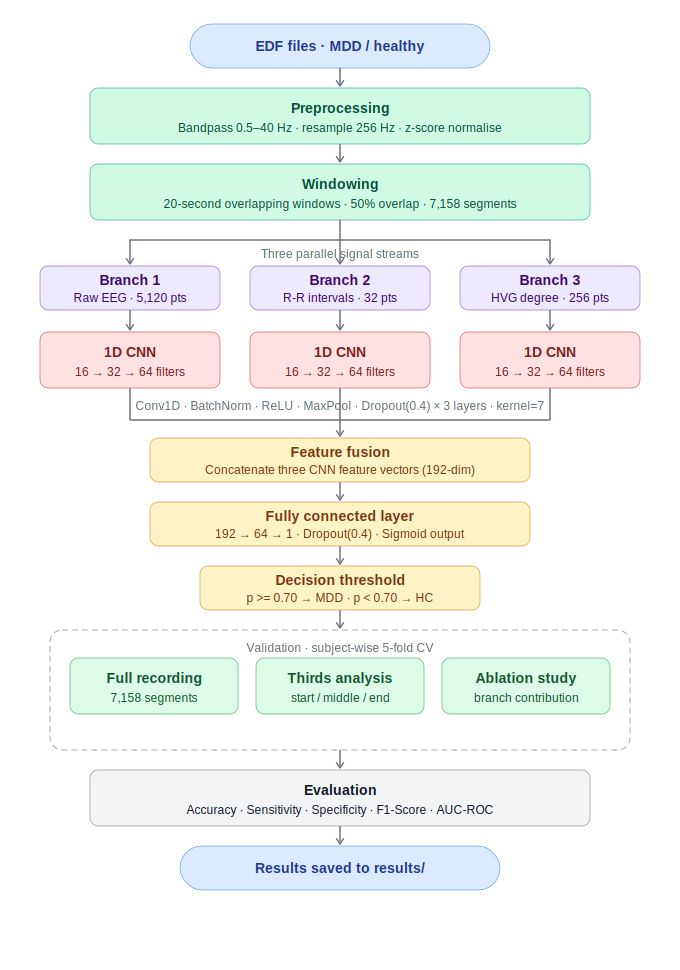
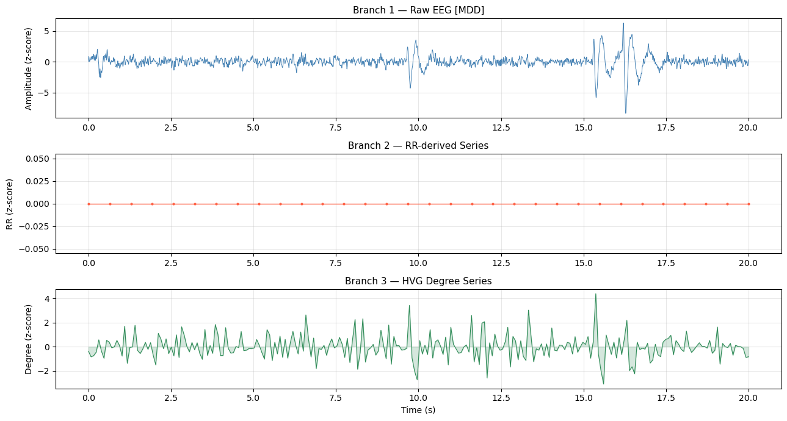
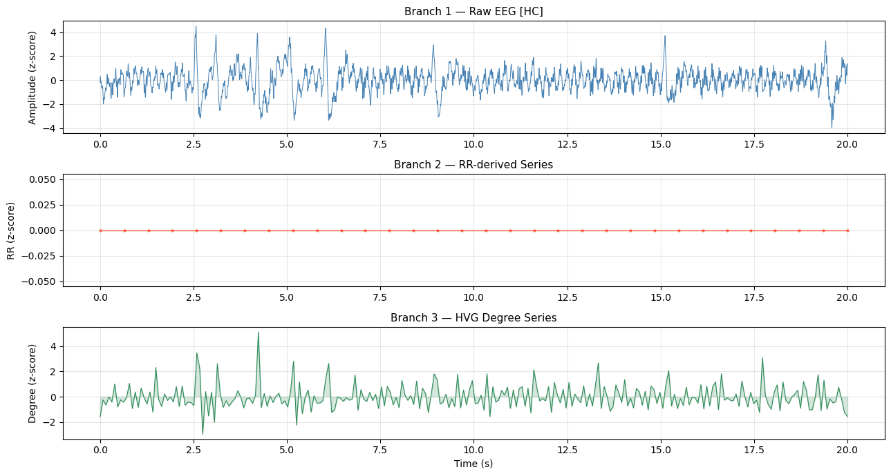

# ECG-Based MDD Detection: Three-Branch CNN Fusion Pipeline

> **Raw EEG · R-R Intervals · HVG Degree Series → Feature Fusion → CNN Classifier**

A Jupyter notebook implementing a three-branch 1D CNN architecture for detecting Major Depressive Disorder (MDD) from single-channel EEG recordings processed as ECG-like signals. Three parallel signal representations — raw waveform, beat-to-beat R-R intervals, and Horizontal Visibility Graph (HVG) degree series — are independently encoded by separate CNN branches, fused, and classified with a sigmoid output at a tuned decision threshold.

---

## Table of Contents

1. [Project Overview](#project-overview)
2. [Methodology Pipeline](#methodology-pipeline)
3. [Dataset & Directory Structure](#dataset--directory-structure)
4. [Installation](#installation)
5. [Configuration](#configuration)
6. [Notebook Cells](#notebook-cells)
7. [Three Signal Branches](#three-signal-branches)
8. [Model Architecture](#model-architecture)
9. [Results](#results)
10. [Signal Branch Visualisations](#signal-branch-visualisations)
11. [Additional Analyses](#additional-analyses)
12. [Saved Outputs](#saved-outputs)
13. [Dependencies](#dependencies)

---

## Project Overview

| Item | Detail |
|------|--------|
| Task | Binary classification: MDD (label 1) vs Healthy Control HC (label 0) |
| Input signal | Single-channel EEG (`EEG Fp1-LE`) used as ECG surrogate |
| Subjects | 95 MDD + 84 HC = **181 subjects** |
| Segments | **7,158** (MDD = 3,798 · HC = 3,360) |
| Window | 20 s overlapping, 50% overlap |
| Model | Three-branch 1D CNN fusion · **100,865 parameters** |
| Decision threshold | **0.70** (paper-optimal) |
| Validation | Subject-wise 5-fold cross-validation |

---

## Methodology Pipeline



---

## Dataset & Directory Structure

```
project-root/
├── EEG data/
│   ├── MDD S1 EO.edf
│   ├── H S1 EC.edf
│   └── ...
├── processed_eeg/          ← auto-created cache (.npy files)
├── results/                ← auto-created results output
├── 5_ECG_MDD_ThreeBranch_CNN_v2_local.ipynb
└── README.md
```

Place all `.edf` files in `EEG data/`. Files starting with `MDD` are labelled 1; files starting with `H` are labelled 0.

---

## Installation

```bash
pip install numpy pandas matplotlib seaborn tqdm mne scipy scikit-learn torch neurokit2
```

> **Note:** `neurokit2` is optional but preferred for R-peak detection. If unavailable, the pipeline falls back to `scipy.signal.find_peaks`.

---

## Configuration

All parameters are set in **Cell 4 — Global Configuration** (`CFG` dict):

| Parameter | Value | Description |
|-----------|-------|-------------|
| `active_channel` | `EEG Fp1-LE` | Single EEG channel used as signal source |
| `target_fs` | `256` Hz | Resampling frequency |
| `bandpass_low` | `0.5` Hz | Bandpass lower cutoff |
| `bandpass_high` | `40.0` Hz | Bandpass upper cutoff |
| `window_sec` | `20` s | Window length |
| `overlap_ratio` | `0.5` | 50% window overlap |
| `rr_maxlen` | `32` | R-R interval series length (padded/truncated) |
| `hvg_maxlen` | `256` | HVG degree series length |
| `cnn_filters` | `[16, 32, 64]` | Conv layer output channels |
| `cnn_kernel` | `7` | Convolutional kernel size |
| `dropout` | `0.4` | Dropout rate |
| `batch_size` | `32` | Training batch size |
| `lr` | `0.001` | Adam learning rate |
| `epochs` | `25` | Maximum training epochs (with early stopping) |
| `k_folds` | `5` | Number of CV folds |
| `decision_thr` | `0.70` | Sigmoid decision threshold |

---

## Notebook Cells

| Cell | Description |
|------|-------------|
| 1 | Environment check · optional `neurokit2` import |
| 2 | Imports: NumPy, Pandas, MNE, PyTorch, scikit-learn, tqdm |
| 3 | Dataset path setup · count MDD / HC EDF files |
| 4 | Global configuration (`CFG` dict) |
| 5 | Dataset audit · verify channel names in all EDF files |
| 6 | Signal processing functions: bandpass, R-peak detection, R-R series, HVG degrees, windowing |
| 7 | Build segment dataset from EDF files · cache `.npy` arrays to disk |
| 8 | Visualise the three signal branches (MDD and HC examples) |
| 9 | Three-branch CNN architecture definition |
| 10 | Dataset class (`EEGSegmentDataset`) and training utilities |
| 11 | Subject-wise 5-fold cross-validation training loop |
| 12 | Results summary table (IEEE format) |
| 13 | Threshold sensitivity analysis |
| 14 | Recording-thirds validation (start / middle / end) |
| 15 | Ablation study: single-branch contribution |
| 16 | Learning curves, confusion matrices, ROC curves |
| 17 | Final summary and reviewer checklist |

---

## Three Signal Branches

Each 20-second window is converted into three independent representations fed to separate CNN branches:

### Branch 1 — Raw EEG waveform
The bandpass-filtered, z-score normalised EEG signal at 256 Hz.
- Input length: `20 s × 256 Hz = 5,120 samples`
- Captures morphological features of the raw oscillation.

### Branch 2 — R-R interval series
Beat-to-beat intervals derived from detected R-peaks in the signal (HRV).
- R-peaks detected using `neurokit2` (or `scipy` fallback).
- Series interpolated and resampled, then zero-padded to fixed length.
- Input length: **32 samples**
- Captures autonomic nervous system / cardiac rhythm features.

### Branch 3 — HVG degree series
The degree sequence of the Horizontal Visibility Graph (HVG) built from the raw signal.
- Computed in O(N) time using a monotone-stack algorithm.
- Encodes nonlinear complexity and temporal structure.
- Input length: **256 samples**

---

## Model Architecture

```
Branch 1 (5120)     Branch 2 (32)      Branch 3 (256)
     │                   │                   │
  1D CNN              1D CNN              1D CNN
Conv1D(1→16)       Conv1D(1→16)       Conv1D(1→16)
Conv1D(16→32)      Conv1D(16→32)      Conv1D(16→32)
Conv1D(32→64)      Conv1D(32→64)      Conv1D(32→64)
  GAP(64)            GAP(64)            GAP(64)
     │                   │                   │
     └───────────────────┴───────────────────┘
                         │
               Concatenate (192-dim)
                         │
               FC(192 → 64) + ReLU + Dropout(0.4)
                         │
               FC(64 → 1) + Sigmoid
                         │
              Threshold 0.70 → MDD / HC
```

Each `ConvBlock1D` = `Conv1D → BatchNorm → ReLU → MaxPool(2) → Dropout`

| Component | Detail |
|-----------|--------|
| Filters | 16 → 32 → 64 per branch |
| Kernel size | 7 |
| Pooling | MaxPool1D(2) after each block |
| Dropout | 0.4 |
| Total parameters | **100,865** |
| Loss | `BCELoss` |
| Optimiser | Adam, lr = 0.001 |
| Early stopping | Patience = 12 epochs |

---

## Results

### 5-fold subject-wise cross-validation

| Fold | Accuracy | Sensitivity | Specificity | F1-Score | AUC-ROC |
|------|----------|-------------|-------------|----------|---------|
| 1 | 79.96% | 78.53% | 81.53% | 80.35% | 86.64% |
| 2 | 86.07% | 83.95% | 88.24% | 85.89% | 94.35% |
| 3 | 88.61% | 88.46% | 88.77% | 88.95% | 94.77% |
| 4 | 83.30% | 77.18% | 90.00% | 82.85% | 92.49% |
| 5 | 94.78% | 98.59% | 89.30% | 95.71% | 98.03% |
| **Mean ± Std** | **86.55 ± 5.62%** | **85.34 ± 8.66%** | **87.57 ± 3.44%** | **86.75 ± 5.96%** | **93.26 ± 4.20%** |

> Decision threshold = **0.70** · Early stopping triggered between epochs 6–14.

**Key observations:**
- Fold 5 achieves the highest performance (94.78% accuracy, 98.03% AUC), suggesting strong signal in some subject subgroups.
- Specificity is more stable (std 3.44%) than sensitivity (std 8.66%), indicating consistent HC detection.
- Mean AUC of **0.9326** demonstrates strong discriminative ability across all folds.

---

## Signal Branch Visualisations

### MDD subject — sample window



### Healthy control subject — sample window



The three plots per subject show (top to bottom): Branch 1 raw EEG waveform, Branch 2 R-R interval series, Branch 3 HVG degree series — all z-score normalised over the 20-second window.

---

## Additional Analyses

### Recording-thirds validation (Cell 14)
The full recording of each subject is split into three temporal thirds (start / middle / end), each yielding **2,236 segments** (MDD = 1,184, HC = 1,052). Separate 5-fold CV runs on each third test whether MDD biomarkers are uniformly distributed across the recording duration or concentrated at a particular time.

### Ablation study (Cell 15)
Each branch is tested in isolation using a `SingleBranchModel` (one CNN branch + FC head) to quantify the individual contribution of:
- Branch 1 only — Raw EEG
- Branch 2 only — R-R HRV
- Branch 3 only — HVG degree series

> The ablation run encountered a `NameError` (`ECGSegmentDataset` not defined in scope) and did not complete in this notebook execution.

### Threshold sensitivity analysis (Cell 13)
Sweeps the decision threshold from 0.0 to 1.0 to identify the optimal balance between sensitivity and specificity. The paper-recommended threshold of **0.70** favours precision in MDD detection.

---

## Saved Outputs

| File / Folder | Contents |
|---------------|----------|
| `processed_eeg/X_raw.npy` | Raw EEG segments array `(7158, 5120)` |
| `processed_eeg/X_rr.npy` | R-R interval segments `(7158, 32)` |
| `processed_eeg/X_hvg.npy` | HVG degree segments `(7158, 256)` |
| `processed_eeg/y.npy` | Labels `(7158,)` |
| `processed_eeg/sids.npy` | Subject ID per segment `(7158,)` |
| `processed_eeg/X_raw_{third}.npy` | Per-third raw arrays (start/middle/end) |
| `results/` | CV metrics, confusion matrices, ROC curves |

---

## Dependencies

| Library | Purpose |
|---------|---------|
| `mne` | EDF file loading and channel access |
| `numpy`, `scipy` | Signal processing, R-peak detection, interpolation |
| `torch` | 1D CNN model, training loop, BCELoss |
| `sklearn` | Stratified K-fold, metrics (accuracy, F1, AUC, confusion matrix) |
| `neurokit2` | R-peak detection (optional, preferred) |
| `pandas` | Results tables |
| `matplotlib`, `seaborn` | Signal visualisation, learning curves |
| `tqdm` | Progress bars |
