# EEG-Based Major Depressive Disorder (MDD) Classification

> **Pipeline: Data Loading → Preprocessing → Feature Extraction → Feature Selection → Classification → Evaluation**

A Jupyter notebook implementing a complete subject-level EEG classification pipeline for distinguishing MDD patients from healthy controls (HC). The notebook evaluates two channel configurations (19-channel and 4-channel), three feature sets (Spectral, Asymmetry, Combined), and three classifiers validated with 100-repetition Monte Carlo 10-fold cross-validation.

---

## Table of Contents

1. [Project Overview](#project-overview)
2. [Methodology Pipeline](#methodology-pipeline)
3. [Dataset & Directory Structure](#dataset--directory-structure)
4. [Installation](#installation)
5. [Configuration](#configuration)
6. [Notebook Sections](#notebook-sections)
7. [Features](#features)
8. [Models & Validation](#models--validation)
9. [Results](#results)
10. [Confusion Matrices](#confusion-matrices)
11. [ROC Curves](#roc-curves)
12. [Feature Rankings](#feature-rankings)
13. [Accuracy vs Feature Subset Size](#accuracy-vs-feature-subset-size)
14. [Alpha Asymmetry Visualisation](#alpha-asymmetry-visualisation)
15. [Saved Outputs](#saved-outputs)
16. [Dependencies](#dependencies)

---

## Project Overview

This pipeline classifies Major Depressive Disorder from resting-state EEG recordings at the **subject level** (one feature vector per subject, not per window). Features are derived from the Power Spectral Density of four frequency bands and from alpha interhemispheric asymmetry. AUC-based univariate feature selection narrows the feature space before classification with Monte Carlo cross-validation.

| Configuration | Subjects | Features | Classifiers |
|---|---|---|---|
| 19-Channel | 95 MDD + 84 HC | 76 spectral + 8 asymmetry = **84 total** | LR, SVM, NB |
| 4-Channel | 95 MDD + 84 HC | 16 spectral + 2 asymmetry = **18 total** | LR, SVM, NB |

---

## Methodology Pipeline


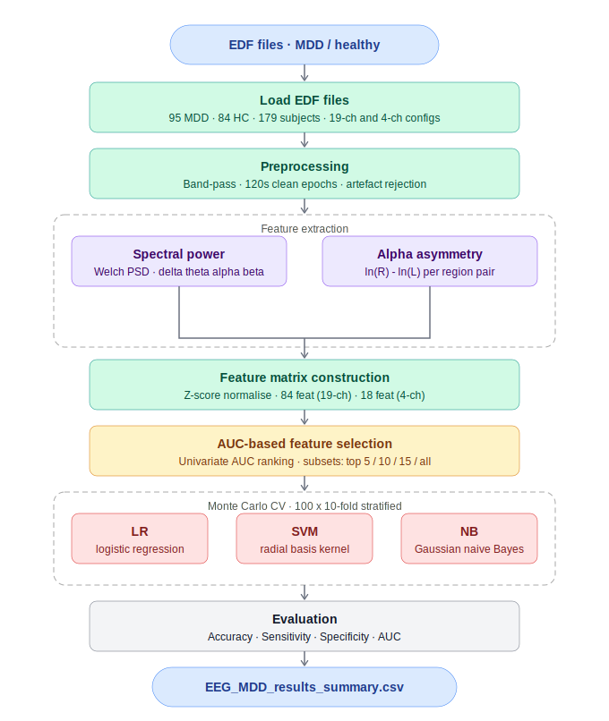

---

## Dataset & Directory Structure

Place all `.edf` files in a folder named `EEG data/` at the project root. Files are automatically split into MDD and HC groups based on their filenames.

```
project-root/
├── EEG data/
│   ├── subject_mdd_01.edf
│   ├── subject_hc_01.edf
│   └── ...
├── 6_no_EEG_MDD_Classification.ipynb
├── EEG_MDD_results_summary.csv        ← generated on run
└── README_no_EEG_MDD.md
```

---

## Installation

```bash
pip install mne numpy pandas matplotlib seaborn scipy scikit-learn tqdm
```

---

## Configuration

All parameters are set in **Cell 2 — Global Configuration**:

| Parameter | Value | Description |
|-----------|-------|-------------|
| `EEG_DIR` | `"EEG data"` | Folder containing `.edf` files |
| `CLEAN_DURATION_SEC` | `120` | Seconds of clean signal per subject |
| `WELCH_NPERSEG` | `256` | Welch window length (samples) |
| `N_FOLDS` | `10` | CV folds per repetition |
| `N_REPEATS` | `100` | Monte Carlo repetitions |
| `SEED` | `42` | Global random seed |
| `FEATURE_SUBSETS` | `[5, 10, 15, 19]` | Feature subset sizes to evaluate |

**Frequency bands:**

| Band | Range |
|------|-------|
| Delta | 0.5 – 4.0 Hz |
| Theta | 4.0 – 8.0 Hz |
| Alpha | 8.0 – 13.0 Hz |
| Beta | 13.0 – 30.0 Hz |

**Asymmetry channel pairs (19-channel):** Frontal-Fp, Frontal-F, Frontal-F7F8, Temporal-T3T4, Temporal-T5T6, Central-C3C4, Parietal-P3P4, Occipital-O1O2

**Asymmetry channel pairs (4-channel):** Frontal-Fp, Frontal-F

---

## Notebook Sections

| Cell | Section | Description |
|------|---------|-------------|
| 1 | Install & Import Libraries | All library imports |
| 2 | Global Configuration | Paths, bands, CV parameters |
| 3 | Data Loading | EDF loading functions (MNE) |
| 4 | Preprocessing | Band-pass filter, epoch selection, artefact rejection |
| 5 | Feature Extraction | Welch PSD band power + alpha asymmetry |
| 6 | Feature Matrix Construction & Z-Score | Build subject-level matrices, column-wise normalisation |
| 7 | AUC-Based Feature Selection | Rank features by univariate AUC, evaluate subset sizes |
| 8 | Classification & Monte Carlo CV | LR, SVM, NB with 100×10-fold CV |
| 9 | Visualisation Helpers | Shared plotting utilities |
| 10 | Full Pipeline Runner | Orchestrates all steps for a given channel config |
| 11 | Run Pipeline: 19-Channel | End-to-end run with all 19 channels |
| 12 | Run Pipeline: 4-Channel | End-to-end run with 4 frontal channels |
| 13 | Results: Summary Tables | Formatted metric tables per feature set |
| 14 | Plots: Feature Rankings | AUC-ranked bar charts per configuration |
| 15 | Plots: Accuracy vs Feature Subset Size | Line plots for each feature set × classifier |
| 16 | Plots: Confusion Matrices & ROC Curves | Aggregate confusion matrices, ROC curves, distribution boxplots |
| 17 | Final Comparison Table (19-ch vs 4-ch) | Side-by-side full results table, saved to CSV |
| 18 | Topographic Alpha Asymmetry Visualisation | Bar charts of mean z-scored asymmetry per region |

---

## Features

### Spectral features (Welch PSD)
Band power computed per channel per band, yielding:
- **19-channel**: 19 channels × 4 bands = **76 features**
- **4-channel**: 4 channels × 4 bands = **16 features**

### Asymmetry features
Alpha interhemispheric asymmetry: `ln(R) − ln(L)` for each hemisphere pair, yielding:
- **19-channel**: 8 region pairs = **8 features**
- **4-channel**: 2 region pairs = **2 features**

---

## Models & Validation

| Classifier | Notes |
|-----------|-------|
| Logistic Regression (LR) | L2 regularisation, `max_iter=1000` |
| Support Vector Machine (SVM) | RBF kernel |
| Naïve Bayes (NB) | Gaussian NB |

**Validation:** 100-repetition Monte Carlo 10-fold stratified cross-validation. Metrics reported as `mean ± std` across all 1,000 folds (100 repeats × 10 folds).

---

## Results

**Dataset:** 95 MDD subjects + 84 HC subjects = **179 subjects total**

### 19-Channel results (100 × 10-fold Monte Carlo CV)

#### Spectral features (top-15 by AUC)

| Classifier | Accuracy (%) | Sensitivity (%) | Specificity (%) | AUC |
|-----------|-------------|----------------|----------------|-----|
| **LR** | **61.41 ± 7.75** | **97.40 ± 5.15** | 20.73 ± 15.97 | **0.8188 ± 0.1050** |
| SVM | 58.81 ± 6.95 | 98.39 ± 4.27 | 14.04 ± 15.14 | 0.8193 ± 0.1053 |
| NB | 53.19 ± 6.02 | 89.73 ± 28.52 | 11.77 ± 24.62 | 0.6075 ± 0.1087 |

#### Asymmetry features (top-8 by AUC)

| Classifier | Accuracy (%) | Sensitivity (%) | Specificity (%) | AUC |
|-----------|-------------|----------------|----------------|-----|
| LR | 53.07 ± 2.62 | 100.00 ± 0.00 | 0.00 ± 0.00 | 0.5000 |
| SVM | 53.07 ± 2.62 | 100.00 ± 0.00 | 0.00 ± 0.00 | 0.5000 |
| NB | 46.93 ± 2.62 | 0.00 ± 0.00 | 100.00 ± 0.00 | — |

#### Combined features (top-15 by AUC)

| Classifier | Accuracy (%) | Sensitivity (%) | Specificity (%) | AUC |
|-----------|-------------|----------------|----------------|-----|
| **LR** | **61.41 ± 7.75** | 97.40 ± 5.15 | 20.73 ± 15.97 | **0.8188** |
| SVM | 58.81 ± 6.95 | 98.39 ± 4.27 | 14.04 ± 15.14 | 0.8193 |
| NB | 53.19 ± 6.02 | 89.73 ± 28.52 | 11.77 ± 24.62 | 0.6075 |

---

### 4-Channel results (100 × 10-fold Monte Carlo CV)

#### Spectral features (top-15 by AUC)

| Classifier | Accuracy (%) | Sensitivity (%) | Specificity (%) | AUC |
|-----------|-------------|----------------|----------------|-----|
| **LR** | **69.31 ± 8.60** | 94.02 ± 7.30 | **41.38 ± 16.99** | **0.8386 ± 0.0983** |
| SVM | 67.22 ± 8.48 | 95.17 ± 6.87 | 35.63 ± 17.36 | 0.8372 ± 0.1010 |
| NB | 52.52 ± 5.70 | 89.62 ± 28.55 | 10.45 ± 25.41 | 0.7752 ± 0.1357 |

#### Asymmetry features (top-2 by AUC)

| Classifier | Accuracy (%) | Sensitivity (%) | Specificity (%) | AUC |
|-----------|-------------|----------------|----------------|-----|
| LR | 53.07 ± 2.62 | 100.00 ± 0.00 | 0.00 ± 0.00 | 0.5000 |
| SVM | 53.07 ± 2.62 | 100.00 ± 0.00 | 0.00 ± 0.00 | 0.5000 |
| NB | 46.93 ± 2.62 | 0.00 ± 0.00 | 100.00 ± 0.00 | — |

#### Combined features (top-15 by AUC)

| Classifier | Accuracy (%) | Sensitivity (%) | Specificity (%) | AUC |
|-----------|-------------|----------------|----------------|-----|
| **LR** | **69.31 ± 8.60** | 94.02 ± 7.30 | 41.38 ± 16.99 | **0.8386** |
| SVM | 67.22 ± 8.48 | 95.17 ± 6.87 | 35.63 ± 17.36 | 0.8372 |
| NB | 52.52 ± 5.70 | 89.62 ± 28.55 | 10.45 ± 25.41 | 0.7752 |

---

### Final comparison: 19-ch vs 4-ch (best results)

| Config | Features | Classifier | Accuracy (%) | Sensitivity (%) | Specificity (%) | AUC |
|--------|---------|-----------|-------------|----------------|----------------|-----|
| 19-Channel | Spectral | **LR** | 61.41 | 97.40 | 20.73 | 0.8188 |
| 19-Channel | Spectral | SVM | 58.81 | 98.39 | 14.04 | 0.8193 |
| 19-Channel | Combined | **LR** | 61.41 | 97.40 | 20.73 | 0.8188 |
| **4-Channel** | Spectral | **LR** | **69.31** | 94.02 | **41.38** | **0.8386** |
| 4-Channel | Spectral | SVM | 67.22 | 95.17 | 35.63 | 0.8372 |
| 4-Channel | Combined | **LR** | **69.31** | 94.02 | **41.38** | **0.8386** |

> **Key finding:** The 4-channel configuration with LR outperforms 19-channel across all metrics, achieving 69.31% accuracy and 0.8386 AUC. Asymmetry features alone fail to generalise (AUC ≈ 0.50 for LR/SVM), consistent with the alpha asymmetry visualisation showing negligible group separation. Spectral band power drives all meaningful discrimination.

---

## Confusion Matrices

Matrices are aggregated across all 1,000 CV folds (100 repeats × 10 folds), so cell counts are in the thousands.

### 19-Channel — Spectral features

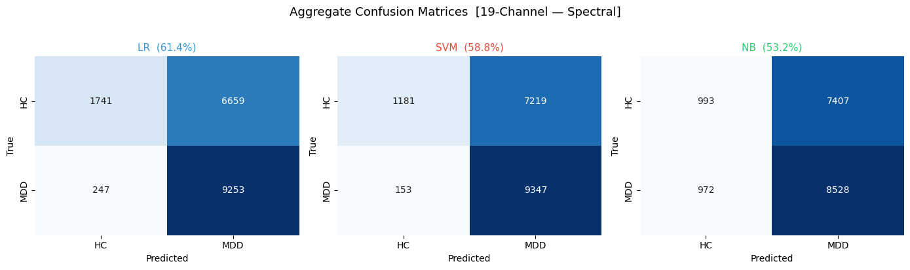

| Classifier | TP (MDD→MDD) | FN (MDD→HC) | FP (HC→MDD) | TN (HC→HC) |
|-----------|-------------|------------|------------|-----------|
| LR (61.4%) | 9,253 | 247 | 6,659 | 1,741 |
| SVM (58.8%) | 9,347 | 153 | 7,219 | 1,181 |
| NB (53.2%) | 8,528 | 972 | 7,407 | 993 |

LR and SVM both show **very high sensitivity but very low specificity** — the classifiers strongly bias toward predicting MDD, reflecting the class imbalance (95 MDD vs 84 HC).

### 19-Channel — Asymmetry features

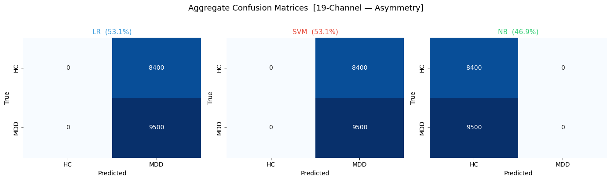

LR and SVM classify **every subject as MDD** (0 true-negatives), confirming that asymmetry features carry no discriminative signal in the 19-channel setup. NB does the opposite — classifying every subject as HC.

---

## ROC Curves

### 19-Channel — Spectral features

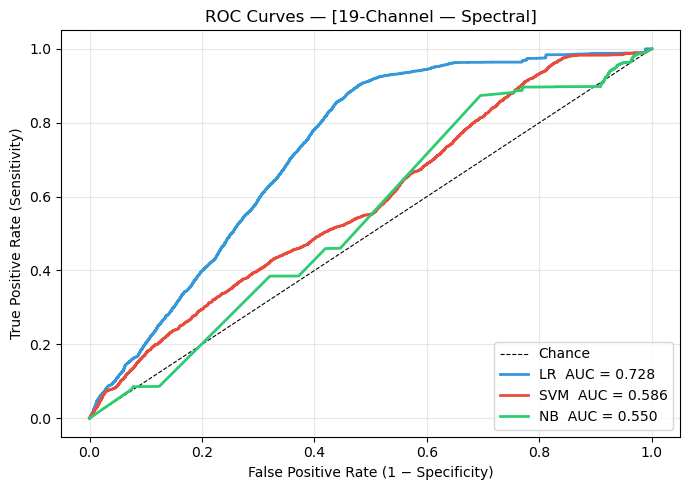

| Classifier | AUC |
|-----------|-----|
| LR | **0.728** |
| SVM | 0.586 |
| NB | 0.550 |

LR achieves a clearly superior ROC curve with AUC 0.728, while SVM and NB remain close to the diagonal.

### 19-Channel — Asymmetry features

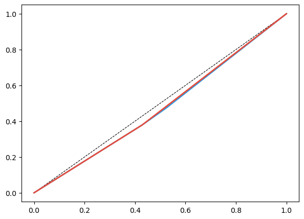

All classifiers produce ROC curves essentially on the diagonal (AUC ≈ 0.50), confirming asymmetry features provide no discriminative power.

---

## Feature Rankings

### 19-Channel — Top-20 features by univariate AUC

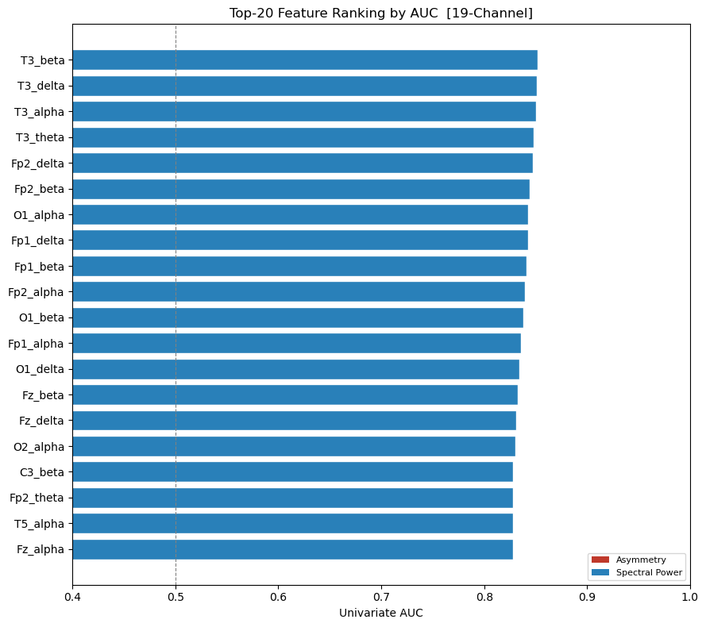

All top features are **spectral power** features (blue). The leading features (`T3_beta`, `T3_delta`, `T3_alpha`, `T3_theta`) are concentrated at the T3 (left temporal) electrode, suggesting left-temporal band power is the strongest univariate discriminator. Asymmetry features (red) do not appear in the top 20.

### 4-Channel — All 18 features ranked by univariate AUC

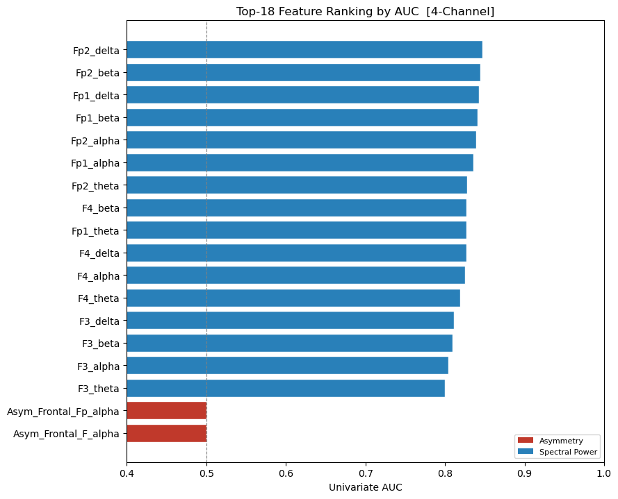

Frontal-parietal channels dominate: `Fp2_delta`, `Fp2_beta`, `Fp1_delta`, `Fp1_beta` lead the ranking (AUC ≈ 0.85). The two asymmetry features (`Asym_Frontal_Fp_alpha`, `Asym_Frontal_F_alpha`) rank last with AUC ≈ 0.50 — random-chance performance.

---

## Accuracy vs Feature Subset Size

### 19-Channel

| Feature set | Plot |
|-------------|------|
| Spectral | 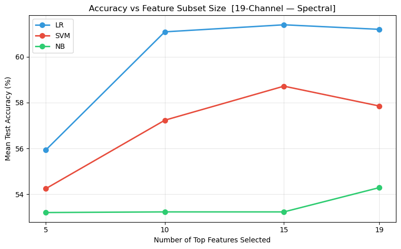 |
| Asymmetry | 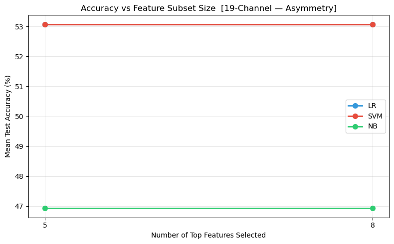 |
| Combined | 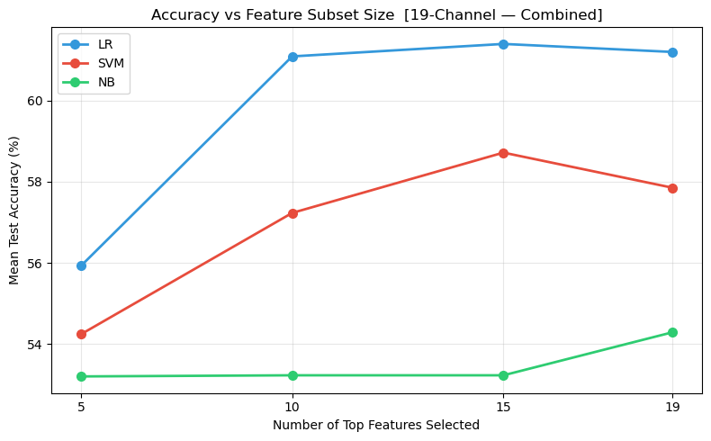 |

LR peaks at ~62% using the top-15 spectral features. Adding more features (up to 19) provides no improvement. Asymmetry features are flat across all subset sizes. NB remains around 53% regardless of subset size.

### 4-Channel

| Feature set | Plot |
|-------------|------|
| Spectral | 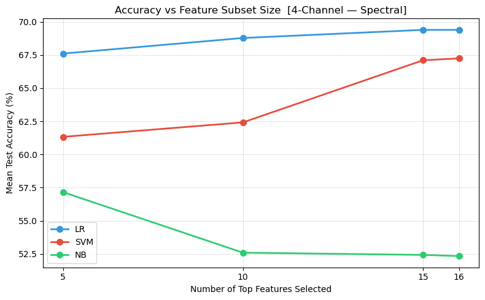 |
| Asymmetry | 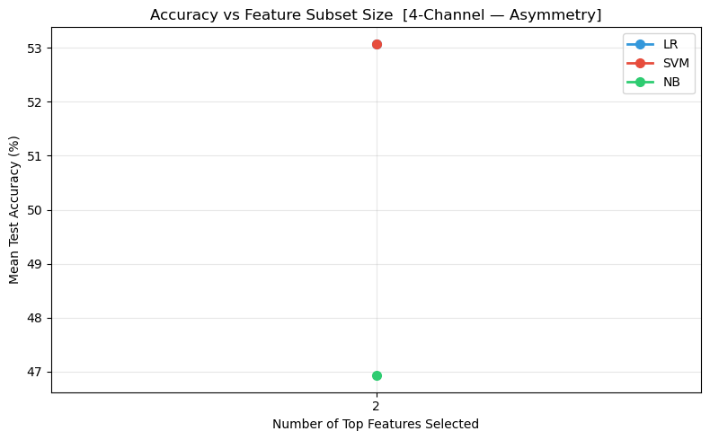 |
| Combined | 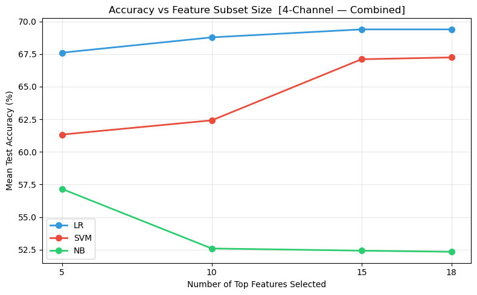 |

LR improves steadily from 67.5% (top-5) to 69.4% (top-15/all) in the 4-channel spectral case. NB drops sharply after top-5 features. Asymmetry (only 2 features) is flat near 53%.

---

## Alpha Asymmetry Visualisation

### 19-Channel — All 8 region pairs

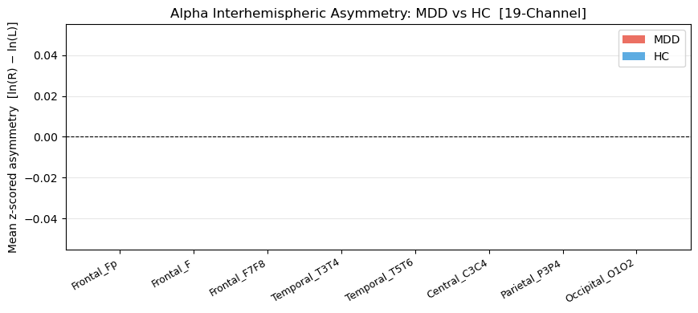

Mean z-scored alpha asymmetry [ln(R) − ln(L)] is effectively zero for both MDD and HC across all 8 electrode pairs, confirming no group-level alpha lateralisation difference in this dataset.

### 4-Channel — 2 frontal pairs

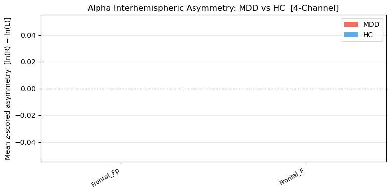

Same finding for the frontal pairs — negligible difference between MDD and HC, consistent with the near-chance AUC of asymmetry features.

---

## Saved Outputs

| File | Description |
|------|-------------|
| `EEG_MDD_results_summary.csv` | Full results table for all configurations, feature sets, and classifiers |

---

## Dependencies

| Library | Purpose |
|---------|---------|
| `mne` | EDF loading and EEG preprocessing |
| `numpy`, `scipy` | Numerical computation, Welch PSD |
| `pandas` | Feature matrix and results tables |
| `matplotlib`, `seaborn` | All visualisations |
| `sklearn` | LR, SVM, NB classifiers; stratified CV; metrics |
| `tqdm` | Progress bars during loading and feature extraction |
